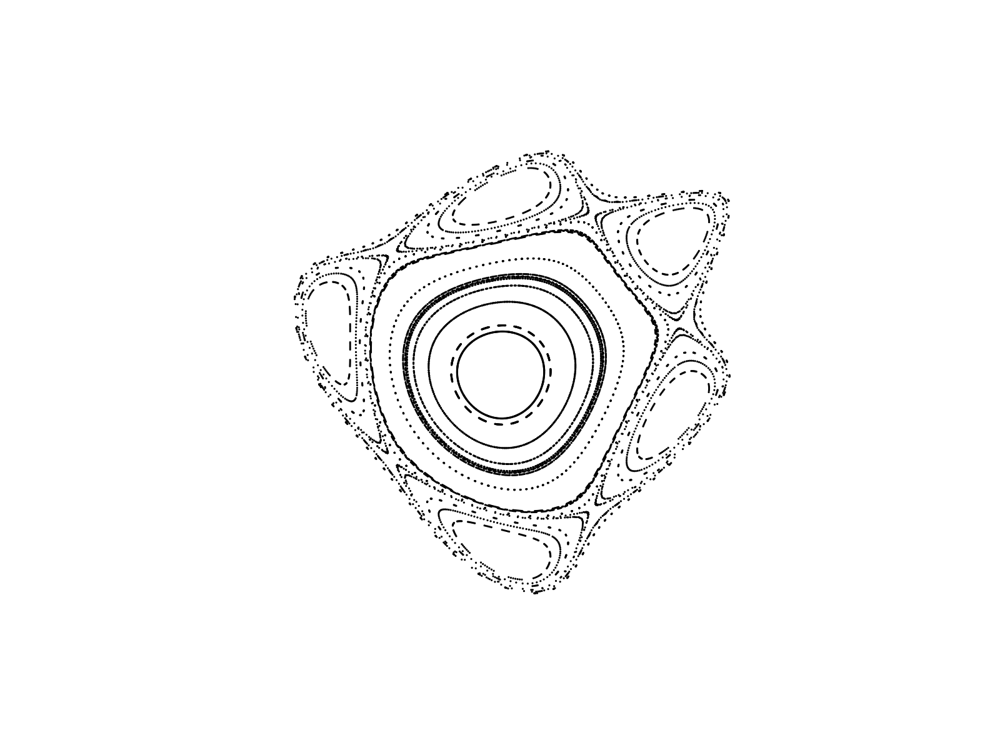

# basicfractalsvg
basicfractalsvg parses BASIC programs to generate SVG images of fractals. It relies on `parslet` and `victor` libraries of ruby to generate the BASIC parser and to build the SVG images, respectively. 

basicfractalsvg can currently parse some of the BASIC programs (e.g., ARCHI, BROWNL, HENON) listed in the book "Fractals: Endlessly Repeated Geometrical Figures" by Hans Lauwerier (Princeton University Press, 1991).


## Use

```sh
basicfractalsvg HENON HENON.svg 500
```

reads BASIC code from `HENON` file to generate `HENON.svg` image after applying a scaling of `500` units. For the BASIC program `HENON` listed in the abovementioned book by Lauwerier (1991), `HENON.svg` shows the orbits of "Hénon's quadratic system" mentioned in the book. 


